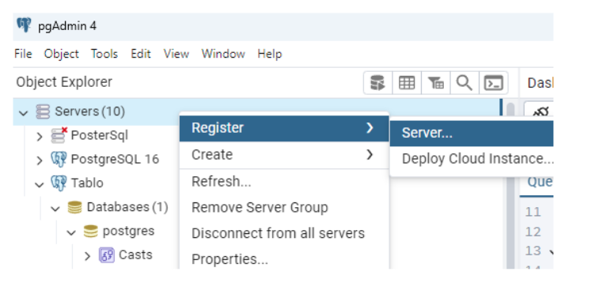
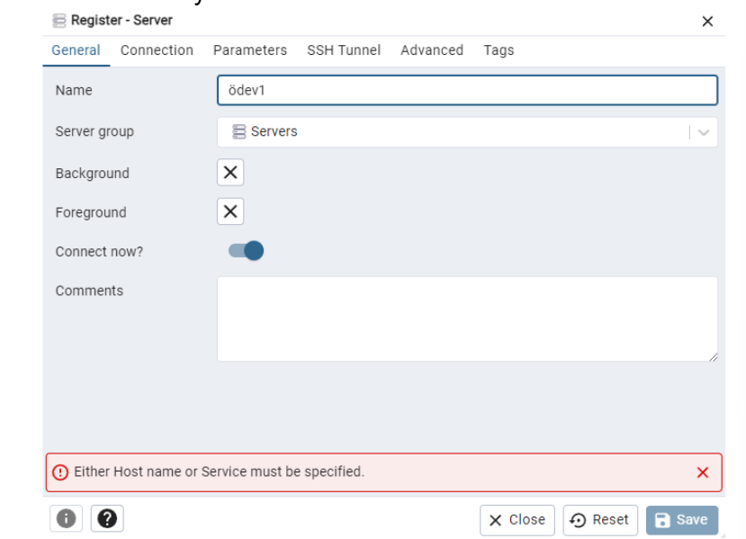
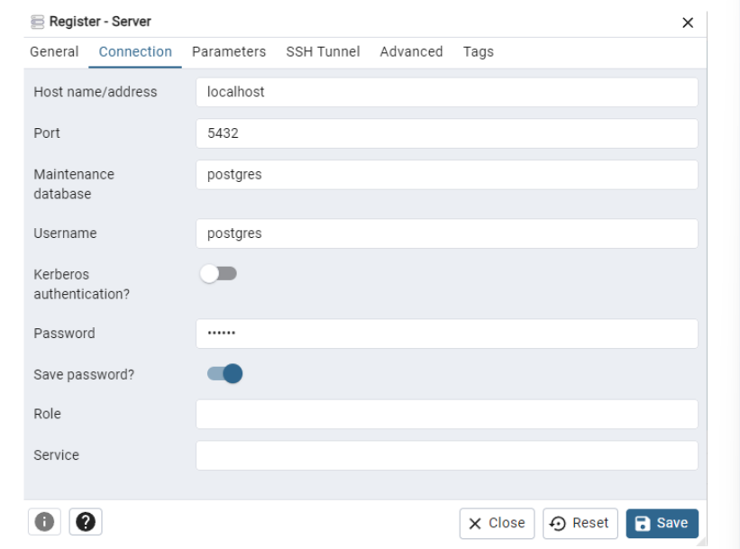
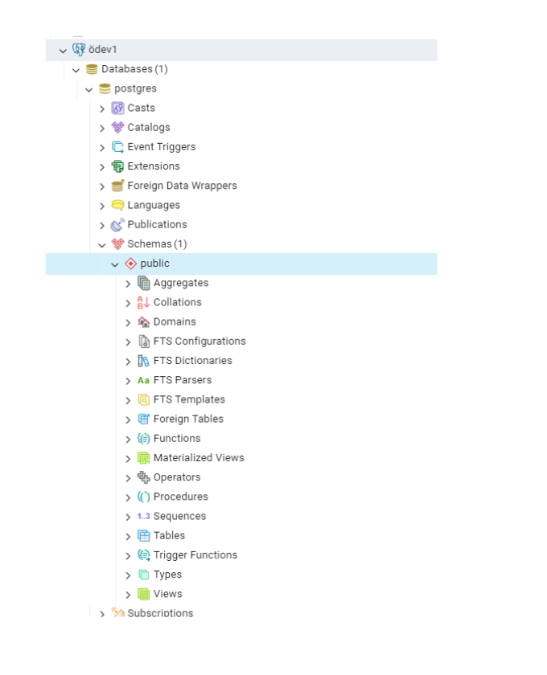
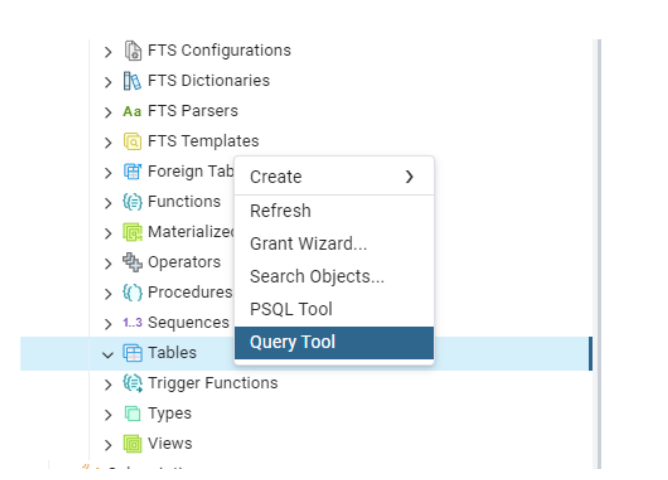
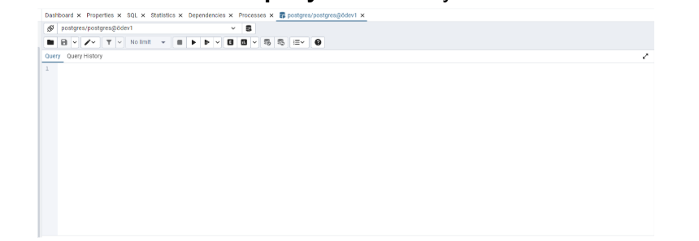
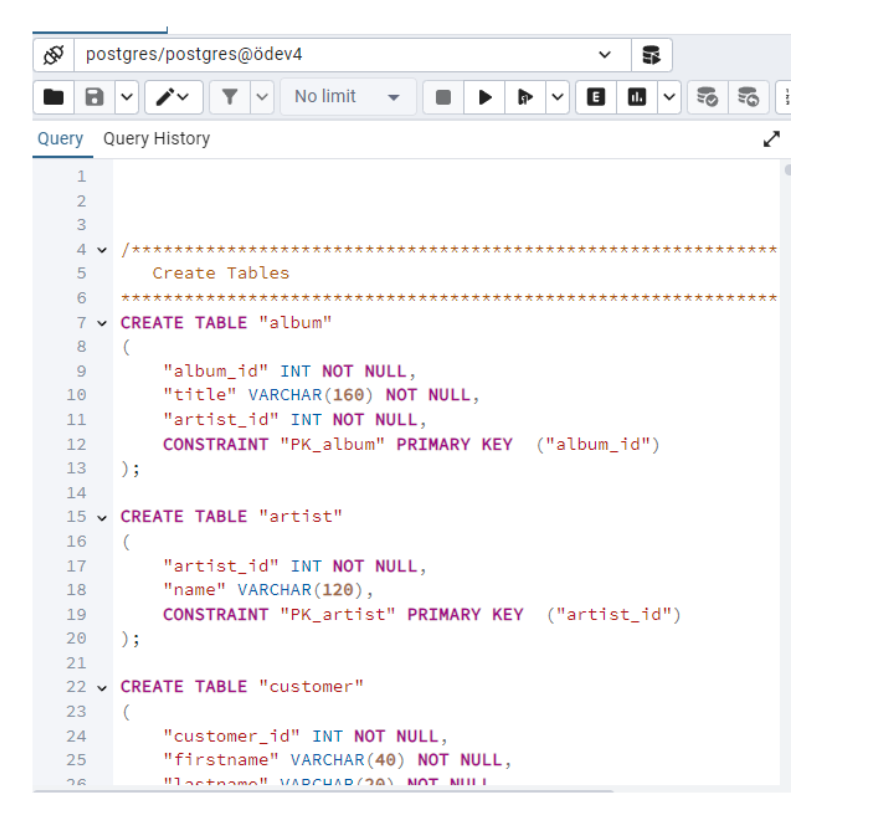

* **1. Adım:** 
İlk olarak servers üzerinde sağ tıklayıp register server diyoruz.

* **2. Adım:** 
İkinci olarak buradan oluşturmak istediğimiz server adını giriyoruz.

* **3. Adım:** 
General’i bitirdikten sonra Connection’a geliyoruz buradan host name kısmına “localhost” giriyoruz. Bundan sonra ise Password kısmına ise kurulum yaparken kullandığımız şifreyi girip save password diyoruz. Bunları yaptıktan sonra ise save tuşuna basıyoruz.

* **4. Adım:** 
Burada ise oluşturduğumuz database in içini açıyoruz “schemas” ondan sonra ise alttan “Tables” a sağ tıklıyoruz

* **5.Adım:**
 Burada ise “query tool” a tıklıyoruz.

* **6.Adım:**
Burada ise sağda dosya işaretine tıklıyoruz açılan yerden “**hafta2.sql**” dosyasını seçiyoruz.   İsterseniz dosya içinde yer alan **“odev_csv_aktarma.sql”** ile ise sadece kullanacağımız tabloyu kurabilirsiniz.

* **7.Adım:**
Burada ise kodlar geldikten sonra f5 tuşuna basarak çalıştırıyoruz ve tablolar gelmiş oluyor. Bazen direk gözükmeye biliyor. Tables üzerine gelip sağ tık “refresh” diyebilirsiniz

