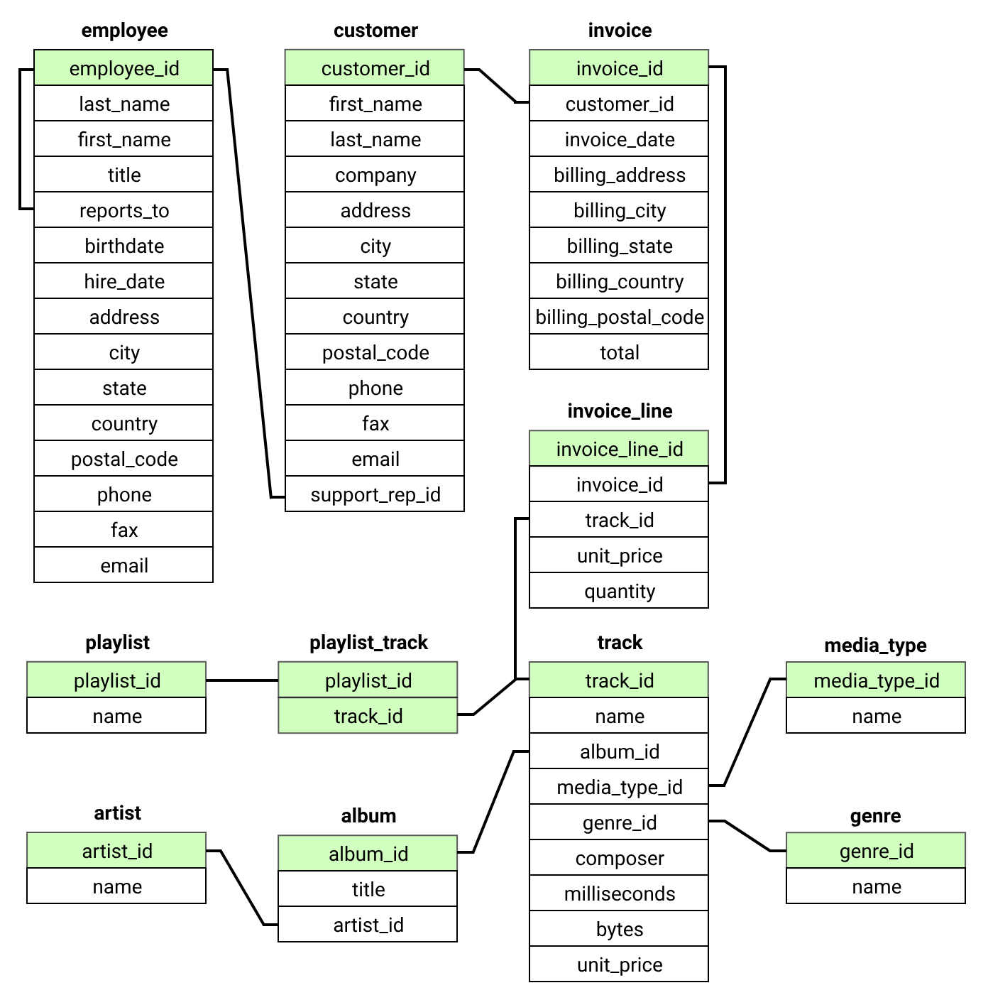

# TURK STUDENT COMMUNITY

## SQL BOOTCAMP ÜÇÜNCÜ HAFTA ÖDEV SORULARI

### 1. Amaç
Turkstudentco'da veri bilimci olarak ilk gününüzde, size Chinook veritabanından **Invoice** tablosu verildi.  
Bu tabloyu inceledikten sonra kafanızda birkaç soru oluştu ve bu soruları cevaplamak için SQL sorguları yazmanız istendi.  
Bu ödevin amacı, veritabanı sorgulama becerilerinizi geliştirmek ve farklı SQL işlemlerini uygulamanızı sağlamaktır.

Tablo İndirme Linki:  
[Google Drive](https://drive.google.com/drive/folders/1bVmqvb79lHNalzohIAR4JE7ghPLWSRTu?usp=sharing)

---

### 2. Invoice Tablosu (Örnek Veri)
Aşağıdaki tablo, İnvoice tablosunun örnek kayıtlarını göstermektedir (tamamı değildir). Kolonlar sırasıyla:
● invoice_id
● customer_id
● invoice_date
● billing_address
● billing_city
● billing_state
● billing_country
● billingpostal_code
● total

| invoice_id | customer_id | invoice_date         | billing_address   | billing_city | billing_state | billing_country | billing_postal_code | total |
|------------|-------------|----------------------|------------------|--------------|---------------|-----------------|---------------------|-------|
| 1          | 18          | 2017-01-03 00:00:00 | 627 Broadway     | New York     | NY            | USA             | 10012-2612          | 15.84 |
| 2          | 30          | 2017-01-03 00:00:00 | 230 Elgin Street | Ottawa       | ON            | Canada          | K2P 1L7             | 9.90  |
| 3          | 40          | 2017-01-05 00:00:00 | 8, Rue Hanovre   | Paris        | None          | France          | 75002               | 1.98  |
| 4          | 18          | 2017-01-06 00:00:00 | 627 Broadway     | New York     | NY            | USA             | 10012-2612          | 7.92  |

---

### Album Tablosu (Örnek Veri)

Aşağıdaki tablo, Album tablosunun örnek kayıtlarını göstermektedir (tamamı değildir). Kolonlar sırasıyla:
● album_id
● title
● artist_id

| album_id | title                                    | artist_id |
|----------|------------------------------------------|-----------|
| 1        | **For Those About To Rock We Salute You**| 1         |
| 2        | **Balls to the Wall**                    | 2         |
| 3        | **Restless and Wild**                    | 2         |
| 4        | **Let There Be Rock**                    | 1         |
| 5        | **Big Ones**                             | 3         |
| 6        | **Jagged Little Pill**                   | 4         |

---

### Artist Tablosu (Örnek Veri)

Aşağıdaki tablo, Artist tablosunun örnek kayıtlarını göstermektedir (tamamı değildir). Kolonlar sırasıyla:
● artist_id
● name

| artist_id | name              |
|-----------|-------------------|
| 1         | AC/DC             |
| 2         | Accept            |
| 3         | Aerosmith         |
| 4         | Alanis Morissette |
| 5         | Alice In Chains   |

Not: Bu tablo Artist yapısının örnek bir kısmını göstermektedir; tam veri seti daha fazladır.

---

### Playlist Tablosu (Örnek Veri)

Aşağıdaki tablo, Playlist tablosunun örnek kayıtlarını göstermektedir (tamamı değildir). Kolonlar sırasıyla:
● playlist_id
● name

| playlist_id | name        |
|-------------|-------------|
| 1           | Music       |
| 2           | Movies      |
| 3           | TV Shows    |
| 4           | Audiobooks  |
| 5           | 90's Music  |

Not: Bu tablo Playlist yapısının örnek bir kısmını göstermektedir; tam veri seti daha fazladır.

---

### PlaylistTrack Tablosu (Örnek Veri)

Aşağıdaki tablo, PlaylistTrack tablosunun örnek kayıtlarını göstermektedir (tamamı değildir). Kolonlar sırasıyla:
● playlist_id
● track_id

| playlist_id | track_id |
|-------------|----------|
| 1           | 1        |
| 1           | 2        |
| 1           | 3        |
| 1           | 4        |
| 1           | 5        |

Not: Bu tablo PlaylistTrack yapısının örnek bir kısmını göstermektedir; tam veri seti daha fazladır.

## Schema 

---

## 3. Sorular

**Soru 1: Invoice Tablosu**  
"USA" ülkesine ait, 2009 yılı içerisinde oluşturulmuş tüm faturaların (Invoice) toplamını listeleyen bir sorgu yazınız.Kullanılacak Tablo: `invoice`

**Soru 2: Track, PlaylistTrack ve Playlist Tablolarında JOIN**  
Tüm parça (track) bilgilerini, bu parçaların ait olduğu playlisttrack ve playlist tablolarıyla birleştirerek (JOIN) listeleyen bir sorgu yazınız.Kullanılacak Tablolar:`track`, `playlisttrack`, `playlist`

**Soru 3: Track, Album ve Artist Tablolarında JOIN**  
"Let There Be Rock" adlı albüme ait tüm parçaları (Track) listeleyen, sanatçı (Artist) bilgisini de içeren bir sorgu yazınız.  
Sonuçları parça süresi (`milliseconds`) büyükten küçüğe sıralayınız.Kullanılacak Tablolar:`track`, `album`, `artist`

---

## 4. Teslim Kuralları ve Şartları

1. SQL sorgularınızı ve kısa açıklamalarınızı içeren bir dosya (.txt, .pdf veya .sql formatında) hazırlayınız.  
2. Sorgularınızı kendi cümlelerinizle açıklayarak, nasıl çalıştığını belirtiniz.  
3. Ödevde örnek cevaplar veya ipuçları verilmemiştir; konuyu öğrendiğiniz şekilde kendi sorgularınızı oluşturmanız beklenmektedir.  
4. Son Teslim Tarihi: **25.03.2025 - 23:59**  
5. Teslim Yeri: [Google Form](https://forms.gle/1WJZCFQtSLdFaw5H7)
